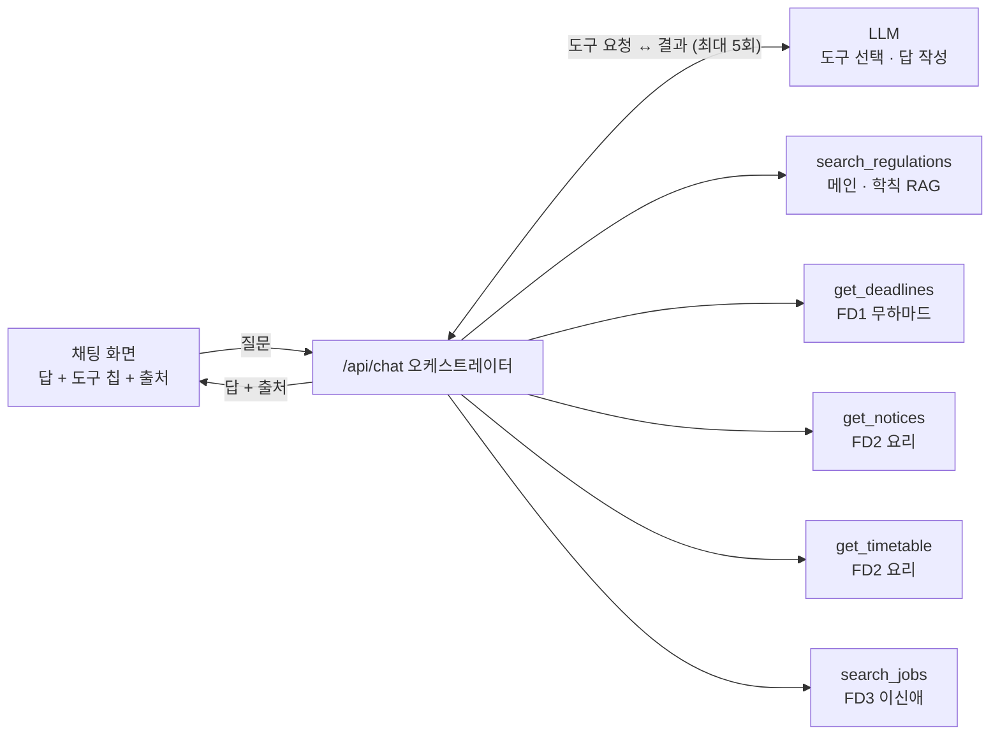

# Dojang PRD · AI 채팅 & 오케스트레이션 (김희경)

> **한 줄 정의**: 유학생이 체류·학교·알바 중 무엇을 물어도 채팅 하나에서 답한다. 오케스트레이터가 FD1~3 도구와 학칙 RAG를 골라 부르고, 결과를 출처와 함께 한 답으로 합친다.
>
> 담당: 김희경 · 마감: 2026-10-03 16:02 (MVP) · 범위: 메인 기능(AI 채팅·오케스트레이션)만. FD1~3의 데이터와 화면은 각 담당 문서에서 다룬다.

## 1. 배경과 목표

- **문제**: 국민대 유학생은 약 2,500명(회의 중 인용, 작년 기준)이다. 비자 연장(6개월~1년 주기)과 건강보험료 납부를 잊어 체납이 쌓이고, 시간제 취업 허가 없이 알바하다 벌금을 무는 사례가 있다.
- **원인**: 안내가 오리엔테이션과 40쪽이 넘는 자료로 한 번에 주어지고, 공지·학칙·체류 정보가 흩어져 있다.
- **목표**: 질문 하나에 필요한 정보를 모아 출처와 함께 답한다. FD 화면 패널과 채팅이 같은 데이터를 쓴다.
- **비목표**: FD1~3 데이터 수집·화면(각 담당), 비자 연장 대행(행정사·대행기관만 가능), 로그인, 대화 서버 저장.

## 2. 내 범위

| 만드는 것 | 설명 |
| --- | --- |
| `POST /api/chat` | 대화를 받아 답, 사용한 도구, 출처를 돌려주는 API |
| 오케스트레이터 | LLM tool use 루프. 도구 호출 최대 5회 |
| 도구 레지스트리 | `ToolDef` 타입 정의 + `backend/src/tools/index.ts`에서 FD 함수 등록 |
| `search_regulations` | 학칙 조 단위 RAG 검색 도구 |
| 시스템 프롬프트 | 역할, 답변 규칙, 데모 사용자 프로필 |
| 채팅 화면 연결 | 메인 질문 카드 + 'AI 상담하기' 화면. 도구 칩과 출처 표시 |

**받아 쓰는 것**(FD 담당이 만들어 줌): `get_deadlines`(FD1 무하마드), `get_notices`·`get_timetable`(FD2 요리), `search_jobs`(FD3 이신애). 형식은 7장 연동 계약을 따른다.

## 3. 채팅이 답해야 하는 질문

시연의 주인공은 5번이다. 질문 하나에 FD1과 FD2를 동시에 불러 합치는 것이 오케스트레이션을 가장 잘 보여준다.

| # | 사용자 질문 예 | 부르는 도구 | 답의 모양 |
| --- | --- | --- | --- |
| 1 | "내 비자 언제까지야? 연장하려면 뭐 해야 돼?" | `get_deadlines` | D-day, 준비물, 출처 링크 |
| 2 | "오늘 수업 뭐 있고, 휴강 공지 있어?" | `get_timetable`, `get_notices` | 오늘 시간표 + 관련 공지 링크 |
| 3 | "Can I work at a convenience store on weekends?" | `search_jobs`, `search_regulations` | 근무 가능 조건 + 공고 3개, 영어로 |
| 4 | "휴학하면 어떻게 돼?" | `search_regulations` | 학칙 조항 번호를 인용한 요약 |
| **5** | **"이번 주에 내가 챙겨야 할 거 정리해줘"** | **`get_deadlines`, `get_timetable`, `get_notices`** | **날짜순 할 일 목록** |
| 6 | 범위 밖이거나 근거를 못 찾은 질문 | 없음(또는 검색 0건) | 모른다고 답하고 학교 담당 부서 문의 안내 |

## 4. 기능 요구사항

| 요구사항 | 우선순위 | 설명 |
| --- | --- | --- |
| 질문 → 답변 | P0 | 메인 질문 카드와 'AI 상담하기' 화면에서 모두 동작 |
| 출처 표시 | P0 | 답 아래에 학칙 조항 번호, 공지·공고 링크 |
| 사용한 도구 표시 | P0 | "공지 확인 · 시간표 확인" 같은 칩을 답 위에. 심사위원이 오케스트레이션을 눈으로 확인하는 방법 |
| 질문 언어로 답변 | P0 | 최소 한국어·영어. 도구 검색어는 LLM이 한국어로 바꿔 보냄 |
| 근거 없으면 추측 금지 | P0 | "확인하지 못했어요" + 문의처 안내. 비자·보험 답은 특히 |
| 대화 맥락 유지 | P1 | 최근 대화 몇 턴을 요청에 함께 보냄. 서버 저장 없음 |
| 답 속 일정 → 캘린더 추가 | P1 | '대신 처리' 기능 후보(10장 미결정 참고) |
| 스트리밍, 이전 채팅 저장 | P2 | 데모에는 "생각 중…" 표시로 대신 |

P0 = 데모 필수, P1 = 시간 되면, P2 = 다음.

## 5. 오케스트레이션 설계

별도 라우터 없이 LLM의 tool use(함수 호출) 루프 하나로 만든다. 모델이 도구 설명을 읽고 필요한 도구를 고르며, 한 번에 여러 개도 부른다. 오늘 안에 만들 수 있는 가장 단순한 구조다.



1. 프론트가 `POST /api/chat`에 `{ messages }`(최근 대화 몇 턴)를 보낸다.
2. 서버가 시스템 프롬프트(역할, 규칙, 데모 사용자 프로필)와 도구 목록을 붙여 LLM을 부른다.
3. LLM이 도구 호출을 돌려주면 서버가 해당 FD 함수를 실행하고 결과를 다시 넘긴다. 최대 5회.
4. LLM이 최종 답을 쓰면 서버가 사용한 도구와 출처를 모아 돌려준다.

```ts
// POST /api/chat 응답
{ answer: string; toolsUsed: string[]; sources: { title: string; url: string }[] }
```

**시스템 프롬프트 규칙**: 질문 언어로 답한다. 도구 결과에 없는 사실은 말하지 않는다. 비자·보험·학칙 답에는 출처를 붙인다.

## 6. RAG 설계

잘 안 바뀌는 문서(학칙·안내문)는 RAG로 검색하고, 자주 바뀌는 데이터(공지·일정·공고)는 FD 도구로 매번 조회한다.

| 자료 | 채팅이 쓰는 방식 |
| --- | --- |
| 국민대 학칙(2026.05.22 개정, hwp) | 조 단위 RAG 인덱스 → `search_regulations` |
| 체류·건강보험 안내문(FD1 제공) | 텍스트로 받아 같은 인덱스에 추가 |
| 학교 공지 | 인덱싱 안 함. `get_notices`로 실시간 조회 |
| 알바 공고 | 인덱싱 안 함. `search_jobs`로 조회 |

1. **변환**: 설치된 한컴오피스 한글에서 '다른 이름으로 저장 → 텍스트'. 안 되면 `pyhwp`의 `hwp5txt`.
2. **청킹**: "제N조(제목)" 단위로 자른다. 긴 조는 항 단위로 다시 자른다. 청크 = `{ article, title, chapter, text }`.
3. **저장**: `backend/data/regulations.json`으로 커밋한다. 원문 hwp는 올리지 않는다.
4. **검색**: 서버 시작 때 메모리에 올리고 BM25(한국어는 2글자 n-gram)로 상위 5개를 돌려준다.
5. **답변**: 검색 결과를 조항 번호와 함께 LLM에 넘기고, 답에 "학칙 제N조"를 인용한다.

임베딩 대신 키워드 검색을 고른 이유는 외부 벡터DB·임베딩 키 없이 1시간 안에 끝낼 수 있기 때문이다. 영어 질문은 LLM이 검색어를 한국어 학칙 용어로 바꿔 넣도록 도구 설명에 적는다. 시간이 남으면 임베딩 검색으로 바꾼다.

## 7. FD 연동 계약 (FD 담당에게 받을 것)

이름과 출력 필드는 13:00에 고정한다. 그 뒤 바꾸려면 메인 담당(김희경)에게 먼저 알린다.

| 도구 | 담당 | 입력 | 출력(항목 배열) | 상태 |
| --- | --- | --- | --- | --- |
| `get_deadlines` | 무하마드 | `{ withinDays? }` | `type`(visa, insurance 등), `title`, `dueDate`, `dDay`, `todo`, `url` | 필요 |
| `get_notices` | 요리 | `{ category?, query?, limit? }` | 기존 `Notice` 그대로. `query` 필터만 추가 | API 구현됨 |
| `get_timetable` | 요리 | `{ date? }` (YYYY-MM-DD) | `day`, `start`, `end`, `course`, `room` | 필요 |
| `search_jobs` | 이신애 | `{ query?, area?, weekend? }` | `title`, `employer`, `wage`, `hoursPerWeek`, `location`, `allowedForD2`, `url` | 필요 |
| `search_regulations` | 김희경 | `{ query }` | `article`, `title`, `text` | 필요 |

1. `backend/src/tools/<도구이름>.ts`에서 `ToolDef` 하나를 export한다. 메인이 `tools/index.ts`에서 모아 등록한다.
2. 같은 Express 서버라 HTTP 대신 함수를 직접 import한다. 화면 패널용 REST 라우트도 같은 함수를 부른다.
3. 결과 항목마다 출처 `url`을 넣는다. 채팅이 링크로 보여준다.
4. 실패하면 throw 대신 `{ error }`를 돌려준다. 오케스트레이터는 그 도구만 빼고 답한다.
5. 14:00까지 실제 데이터가 없으면 같은 형식의 예시 데이터로 먼저 넘긴다.
6. 데모 사용자 정보(비자 종류·만료일 등)는 `backend/data/demo-user.json` 하나에 두고 FD1이 채운다.

```ts
// backend/src/tools/types.ts
export interface ToolDef<I = any, O = unknown> {
  name: string;          // 예: "get_deadlines"
  description: string;   // LLM이 언제 이 도구를 쓸지 판단하는 설명
  inputSchema: object;   // 입력 JSON Schema
  run: (input: I) => Promise<O | { error: string }>;
}
```

## 8. 비기능 요구사항과 데모 합격 기준

- **정확성**: 도구 결과나 학칙 조항에 없는 내용은 답하지 않는다. 시스템 프롬프트에 명시한다.
- **실패 대비**: 도구 하나가 실패해도 나머지로 답한다. LLM 호출이 실패하면 "잠시 후 다시" 안내를 보여준다. 공지는 이미 예시 데이터 폴백이 있다.
- **보안**: LLM API 키는 `backend/.env`에만 둔다. 레포가 public이라 `.env.example`에는 키 이름만 적는다.
- **개인정보**: 대화는 서버에 저장하지 않는다. 데모 사용자는 가상 프로필이다.

데모 합격 기준(리허설에서 하나씩 체크):

- [ ] 시나리오 5가 FD1·FD2를 함께 불러 날짜순 할 일을 답한다
- [ ] 답 위에 사용한 도구 칩이 보인다
- [ ] 학칙 질문에 "제N조"가 인용된다
- [ ] 영어 질문에 영어로 답한다(시나리오 3)
- [ ] 모르는 질문에 지어내지 않고 문의처를 안내한다
- [ ] `npm run check` 통과 후 main에 push됐다

## 9. 내 일정 (2026-10-03)

가장 중요한 관문은 14:00 FD 함수 전달이다. 이것만 지켜지면 나머지는 내 쪽에서 조절할 수 있다.

- [ ] **12:30–13:00 계약 고정**: 도구 5개 이름·입출력을 팀에 공유, LLM 제공자·API 키 결정
- [ ] **13:00–14:00 뼈대**: `/api/chat` + 예시 도구로 루프 완성, 학칙 텍스트 변환·청킹
- [ ] **14:00 관문**: FD 함수 받기(예시 데이터라도 같은 형식)
- [ ] **14:00–15:00 연결**: FD 함수 실제 연결, 채팅 화면 연결
- [ ] **15:00–15:40 다듬기**: 도구 칩·출처 표시, 데모 질문 리허설
- [ ] **15:40–16:02 제출**: 코드 동결 → `npm run check` → main push

## 10. 리스크와 미결정 사항

| 리스크 | 대응 |
| --- | --- |
| LLM 제공자·API 키 미정 | 13:00 전에 결정. 키는 `backend/.env`에만 |
| 학칙 hwp 변환 실패 | 한글에서 PDF로 저장 후 텍스트 추출. 안 되면 휴학·등록·졸업 조항만 수동 발췌 |
| FD 함수가 14:00에 안 옴 | 같은 형식의 예시 데이터로 먼저 돌리고, 오면 교체 |
| 비자·보험 답 환각 | 출처 없는 문장 금지 규칙 + 데모 질문 6개를 리허설에서 미리 검증 |
| 학교 공지 사이트 지연 | 이미 있음: 8초 타임아웃, 10분 캐시, 예시 데이터 폴백 |

**미결정 사항**

- **LLM 제공자**: Claude(예: Sonnet 5.5)를 쓸지, 팀이 이미 가진 다른 키를 쓸지. 키는 누가 내나?
- **'대신 처리' 기능 하나**: 멘토 지적대로 하나는 대신 해줘야 한다. 후보는 ① 답 속 기한을 캘린더에 등록 ② 시간제 취업 허가 신청서 초안 자동 작성.
- **데모 사용자 프로필**: 비자 종류·만료일·학년을 FD1이 정하나? 화면 인사말은 "귀찮은거 물어보세요"이다.
- **지원 언어**: 데모는 한국어·영어 둘로 충분한가?
